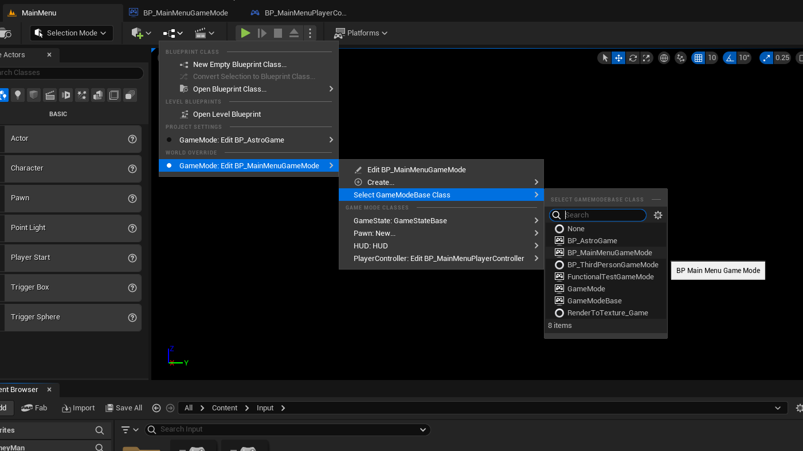
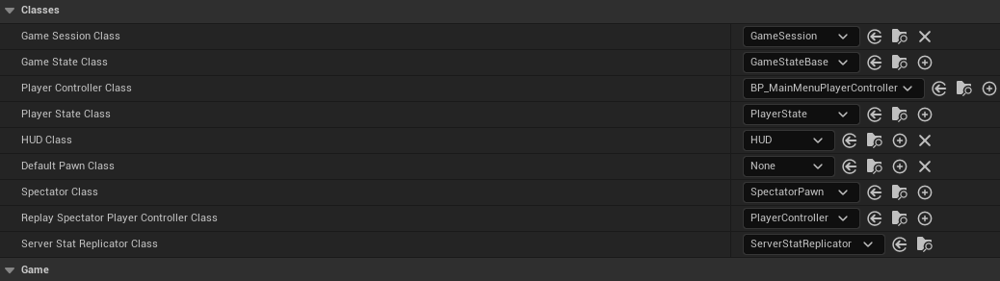
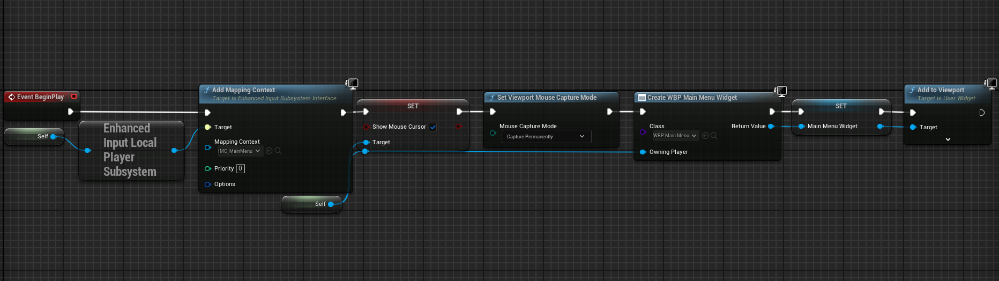
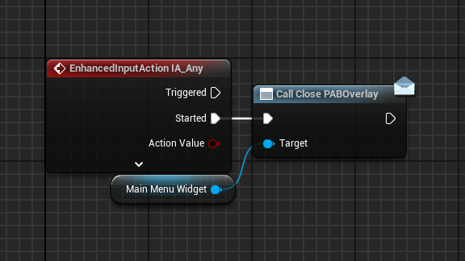
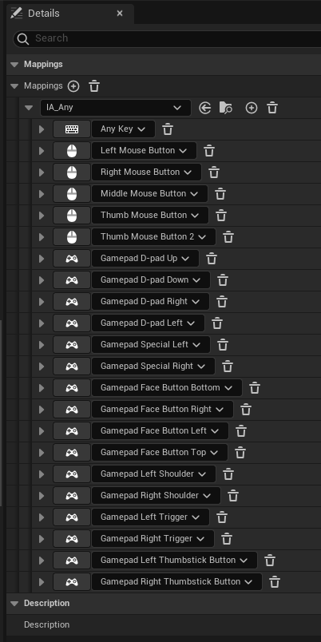
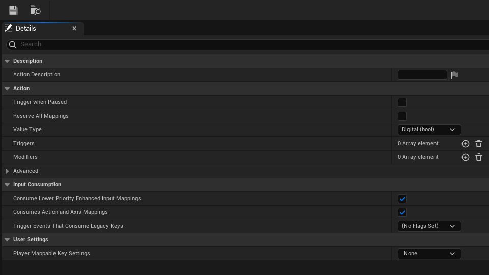

# Menu System Documentation

<!-- Brief overview of all the menus -->
This documentation contains information about how individual menus work, and how they should be set-up.

## Contents

1. [Main Menu](#main-menu)
    1. [Main Menu Level]
    2. [Main Menu UI]
2. [Pause Menu](#pause-menu)
    1. [Pause Actor Component]
3. [Settings Menu](#settings-menu)
    1. [Display Settings](#display-settings)
    2. [Control Settings](#control-settings)
    3. [Sound Settings](#sound-settings)
    4. [Accessibility Settings](#accessibility-settings)
    5. [Config File](#config-file)

## Main Menu

<!-- What goes on in the main menu - PAB Overlay, saves etc -->
The main menu is split up into two parts. The Level, and the UI Blueprint.

### Main Menu Level

The Main Menu level (Content/Levels/MainMenu) is a completely blank and unlit level with a Game Mode blueprint (Content/Blueprints/GameModes/BP_MainMenuGameMode), a Player Controller blueprint (Content/Blueprints/PlayerControllers/BP_MainMenuPlayerController), and an Input Mapping Context (Content/Input/IMC_MainMenu), with accompanying Input Action (Content/Input/InputActions/IA_Any).

The Main Menu level has overridden the projects default GameMode with the MainMenuGameMode blueprint using the World Override dropdown menu.

All the MainMenuGameMode does is tell the game to use the MainMenuPlayerController as the Player Controller.

The player controller does a few things. When the game starts it adds the MainMenu mapping context to the Player Controller's enhanced input subsystem. It then shows and captures the mouse curser. Then becomes the parent for the Main Menu widget.

It also accepts any input that triggers the Any input action. This is meant to be any key/button the player presses. The use of this input event is just to close the Press Any Button overlay.

Theres not much to say about the mapping context and the input action. They're both very basic.
| Mapping Context | Input Action |
|---|---|
|  |  |

### Main Menu UI

## Pause Menu

<!-- How do we activate the pause menu etc -->

## Settings Menu

<!-- Container for submenus -->

### Display Settings

<!-- Why certain settings are locked when behind using certain FullscreenModes etc -->

### Control Settings

<!-- Custom keybinds -->

### Sound Settings

<!-- Class mixes -->

### Accessibility Settings

<!-- NOT IMPLEMENTED -->

### Config File

<!-- How we determine/save/load settings -->
