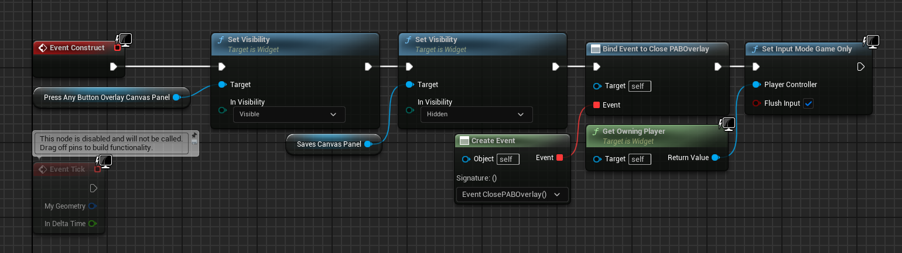
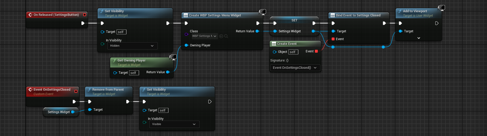
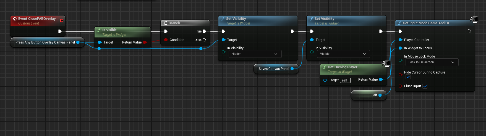

# Menu System Documentation

<!-- Brief overview of all the menus -->
This documentation contains information about how individual menus work, and how they should be set-up.

## Contents

1. [Main Menu](#main-menu)
    1. [Main Menu Level](#main-menu-level)
    2. [Main Menu UI](#main-menu-ui)
2. [Pause Menu](#pause-menu)
    1. [Pause Actor Component](#pause-actor-component)
3. [Settings Menu](#settings-menu)
    1. [Display Settings](#display-settings)
    2. [Control Settings](#control-settings)
    3. [Sound Settings](#sound-settings)
    4. [Accessibility Settings](#accessibility-settings)
    5. [Config File](#config-file)

## Main Menu

<!-- What goes on in the main menu - PAB Overlay, saves etc -->
The main menu is split up into two parts. The Level, and the UI Blueprint.

### Main Menu Level

The Main Menu level (Content/Levels/MainMenu) is a completely blank and unlit level with a Game Mode blueprint (Content/Blueprints/GameModes/BP_MainMenuGameMode), a Player Controller blueprint (Content/Blueprints/PlayerControllers/BP_MainMenuPlayerController), and an Input Mapping Context (Content/Input/IMC_MainMenu), with accompanying Input Action (Content/Input/InputActions/IA_Any).

The Main Menu level has overridden the projects default GameMode with the MainMenuGameMode blueprint using the World Override dropdown menu.

All the MainMenuGameMode does is tell the game to use the MainMenuPlayerController as the Player Controller.

The player controller does a few things. When the game starts it adds the MainMenu mapping context to the Player Controller's enhanced input subsystem. It then shows and captures the mouse curser. Then becomes the parent for the Main Menu widget.

It also accepts any input that triggers the Any input action. This is meant to be any key/button the player presses. The use of this input event is just to close the Press Any Button overlay.

Theres not much to say about the mapping context and the input action. They're both very basic.

| Mapping Context | Input Action |
|---|---|
|  |  |

### Main Menu UI

###### *The logic begind loading/creating new saves has been moved into the SaveTemplate blueprint (Content/UI/SaveMisc/WBP_SaveTemlplate). Please view the [Save System Documentation](SaveSystemDocumentation.md) to learn how loading and creating new saves works.*

The Main Menu Widget Blueprint (Content/UI/WBP_MainMenu) has 3 sections. The "Press Any Button" Overlay, the Saves List, and the bottom right buttons.

When we construct the Main Menu UI, we set the PAB overlay to be visible, we hide the Saves Canval Panel to be hidden, we bind a new event to ClosePABOverlay, and we set the input mode to be game only.

The Settings button in the bottom right works by hiding the Main Menu UI and creating a new Settings Widget to display instead. You can read more about the Settings Menu blueprint [here](#settings-menu). We bind an event called OnSettingsClosed so we can unhide the Main Menu when the Settings get closed.

The Quit button just calls quit game. This button should be removed when we are targeting platforms that don't support it.

<!-- Move this to the bottom? -->
The PAB overlay is a canvas pannel (and should probably be renamed PAB Canvas for clarity) which hides the saves list and bottom right buttons until the player presses any button. We saw earlier that the input event just calls a function on the MainMenu Widget. All that function does it check if the PAB overlay is visible. If it is then hide the overlay, make the Saves Canvas Panel visible (which also contains the buttons), and lock the mouse curser in when in fullscreen.

## Pause Menu

<!-- How do we activate the pause menu etc -->

### Pause Actor Component

<!-- What we did to ensure it isn't affected by the pause -->

## Settings Menu

<!-- Container for submenus -->

### Display Settings

<!-- Why certain settings are locked when behind using certain FullscreenModes etc -->

### Control Settings

<!-- Custom keybinds -->

### Sound Settings

<!-- Class mixes -->

### Accessibility Settings

<!-- NOT IMPLEMENTED -->

### Config File

<!-- How we determine/save/load settings -->
